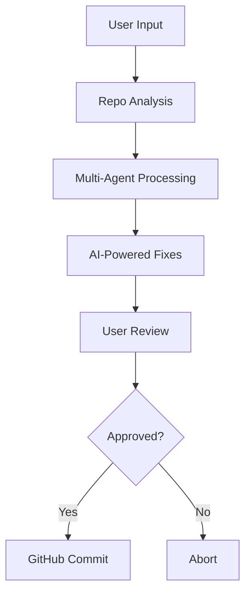
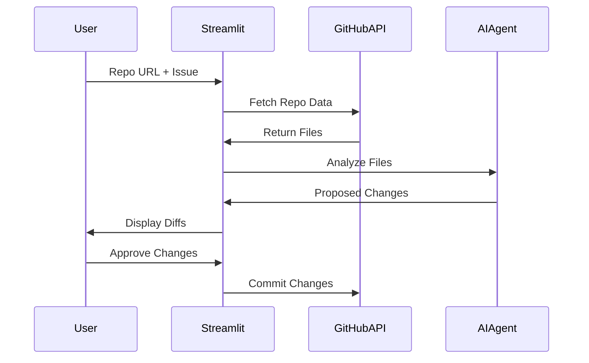

# GitHub Code Resolver

[](https://your-app-url.streamlit.app/)
[](https://opensource.org/licenses/MIT)
[](https://www.python.org/downloads/)

An AI-powered solution for automated code analysis and maintenance in GitHub repositories.

 <!-- Add actual diagram -->

## Table of Contents
- [Overview](#overview)
- [Why GitHub Code Resolver?](#why-github-code-resolver)
- [Features](#features)
- [Technologies Used](#technologies-used)
- [Installation](#installation)
- [Configuration](#configuration)
- [Usage](#usage)
- [How It Works](#how-it-works)
- [Contributing](#contributing)
- [License](#license)
- [Contact](#contact)
- [GitHub Repository](#github-repository)

## Overview

GitHub Code Resolver is an AI-driven development tool that automates code maintenance through three key phases:

1. **Intelligent Analysis**  
   AI agents analyze repository structure and content through GitHub API
2. **Precision Modification**  
   Implements minimal-impact changes while preserving existing code structure
3. **Automated Workflow**  
   One-click approval and commit process with full audit trail


Why GitHub Code Resolver?
Automated Problem Solving
Resolve issues like "fix errors" or "add image and background color" through AI analysis

Full Repository Understanding
Agents can read and process 40+ file types including:

Web: HTML, CSS, JavaScript (React/Next.js)

Programming: Python, Java, C/C++

Config: JSON, YAML, XML

Seamless Integration
Direct GitHub integration with secure token-based access

Minimal Intervention
Preserves 95%+ of original code while implementing targeted fixes

Features
Core Capabilities
Multi-Agent Architecture

Repository Fetcher: Handles GitHub API interactions

Code Analyzer: Cross-file dependency mapping

Modification Engine: Context-aware code changes

Commit Agent: Version control operations

Smart Processing

Before/After code comparisons

Batch modification approval

Custom commit templates

Automatic SHA handling

**Supported File Types**
Category	Formats
Web	HTML, CSS, JS, JSX, TS
Programming	Python, Java, C, C++, C#
Config	JSON, YAML, XML, ENV
Documentation	MD, RST
Technologies Used
Core Stack

Python 3.8+

Streamlit 1.32+

Phidata 2.3+

Google Gemini API

GitHub REST API v3

**Key Libraries**

python-dotenv 1.0+

PyGithub 2.2+

SQLAlchemy 2.0+

Base64 Encoding

**Installation**
**Requirements**
Python 3.8+

GitHub Developer Token

Google Cloud API Key

Set -Up

# Clone repository
git clone https://github.com/yourusername/github-code-resolver.git
cd github-code-resolver

# Create virtual environment
python -m venv venv
source venv/bin/activate  # Linux/MacOS
venv\Scripts\activate    # Windows

# Install dependencies
pip install -r requirements.txt

**Configuration**
1.Create .env file:
GEMINI_API_KEY=your_google_api_key
GITHUB_TOKEN=your_github_pat
GITHUB_USERNAME=your_username

2.GitHub Token Permissions:

repo (Full access)

admin:repo_hook (Read/write)

workflow (Write access)


**Usage**

1.Start the application:
```bash
streamlit run main.py
```
2.Application Workflow:

Input GitHub Repository URL
Example: https://github.com/username/repo

Describe the Issue
Example: "Fix authentication errors in login module"

Review Changes
Interactive diff viewer with side-by-side comparison

Commit Changes
One-click commit with automatic SHA handling

How It Works

Architecture



**Key Processes**
1.Repository Analysis

URL parsing and branch detection

Recursive file tree scanning

Content fetching with Base64 decoding

2.AI Processing

Context-aware code analysis

Minimal modification generation

Change validation and conflict detection

3.Version Control

Automatic SHA management

Branch-aware commits

Atomic operations
